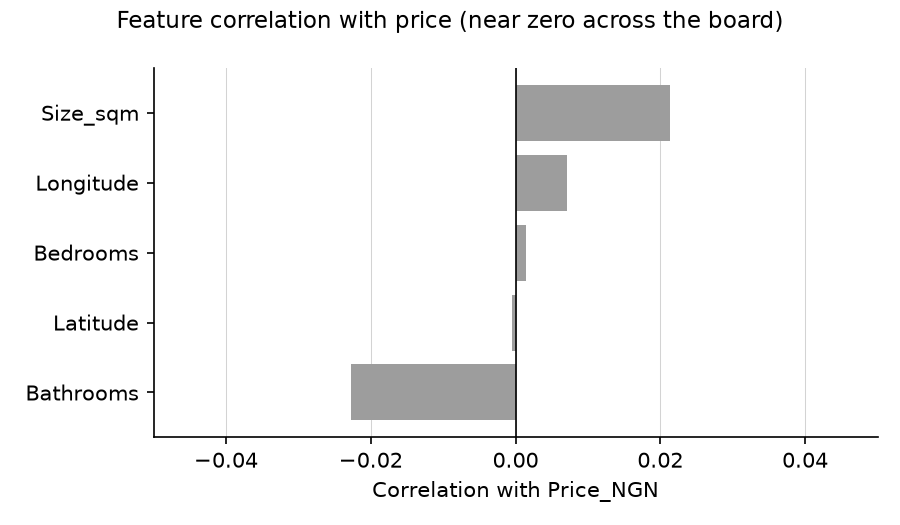

# Nigerian House Price Prediction

Predicts `Price_NGN` for Nigerian housing listings (`data/clean_nig_housing_dset.csv`,
1,862 listings across 10 cities), comparing six regression algorithms — from plain
linear regression to a neural network — and serving the comparison plus a live
predictor through a Streamlit dashboard.

## Setup

```bash
python3 -m venv .venv
source .venv/bin/activate
pip install -r requirements.txt
```

## Usage

Train and compare all models (writes fitted pipelines + metrics to `models/`):

```bash
python -m src.train
```

Launch the dashboard (auto-trains on first run if `models/` doesn't exist yet):

```bash
streamlit run app.py
```

## Results

Each model was trained inside an identical `Pipeline` (one-hot encoding for
categorical features, standard scaling for numeric features) on an 80/20 train/test
split, and also scored with 5-fold cross-validation.


| Model | RMSE (₦) | MAE (₦) | R² | CV R² (mean ± std) |
|---|---:|---:|---:|---:|
| **Ridge Regression** | **144,444,830** | **124,246,255** | **-0.051** | **-0.034 ± 0.012** |
| Linear Regression | 144,641,758 | 124,470,395 | -0.053 | -0.035 ± 0.014 |
| Random Forest | 147,157,800 | 126,251,418 | -0.090 | -0.068 ± 0.023 |
| Gradient Boosting | 148,911,774 | 126,373,902 | -0.117 | -0.080 ± 0.027 |
| Decision Tree | 163,608,754 | 133,294,401 | -0.348 | -0.273 ± 0.097 |
| Neural Net (MLP) | 204,002,615 | 147,504,345 | -1.096 | -1.167 ± 0.087 |

**Best performer: Ridge Regression**, with the lowest test RMSE (₦144.4M), lowest
MAE (₦124.2M), and the highest R² (-0.051, essentially tied with plain Linear
Regression). Every model's R² is negative, meaning none of them beat the trivial
baseline of predicting the mean price.

### Why every model underperforms

None of the input features have a meaningful relationship with `Price_NGN` in this
dataset — correlations with price are all within ±0.02, and city/property-type
group averages differ by only a few percent:



Regularized linear models (Ridge/Linear) win by default here: with no real
signal to fit, the flexible models (Decision Tree, Random Forest, Gradient
Boosting, MLP) latch onto noise in the training split and generalize worse, while
the simplest models degrade most gracefully. This points to the dataset itself —
prices don't appear to be derived from size, location, or property type — rather
than a modeling bug. Charts are regenerated from `models/metrics.csv` via:

```bash
python -m scripts.generate_report_assets
```

## Project structure

- `src/data.py` — feature/target schema and the shared preprocessing pipeline
- `src/train.py` — trains, scores, and saves all six models
- `app.py` — Streamlit dashboard (model comparison + interactive predictor)
- `scripts/generate_report_assets.py` — regenerates the charts in this README
