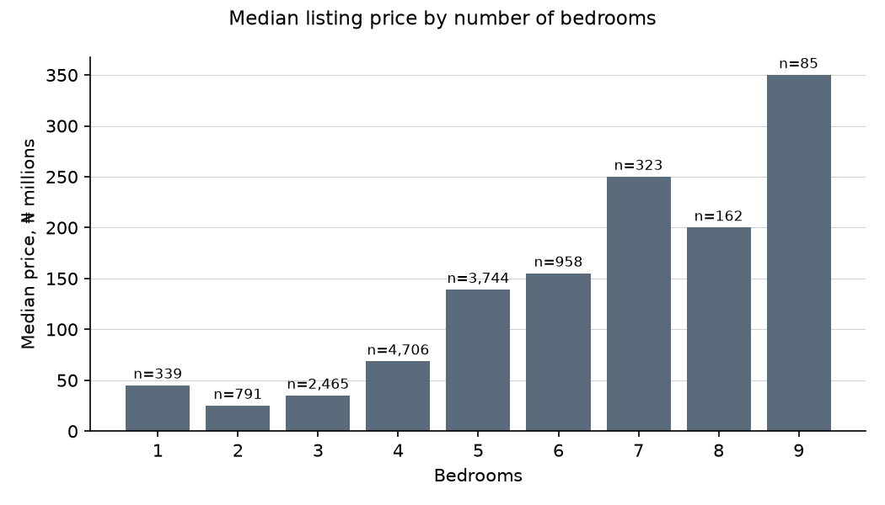
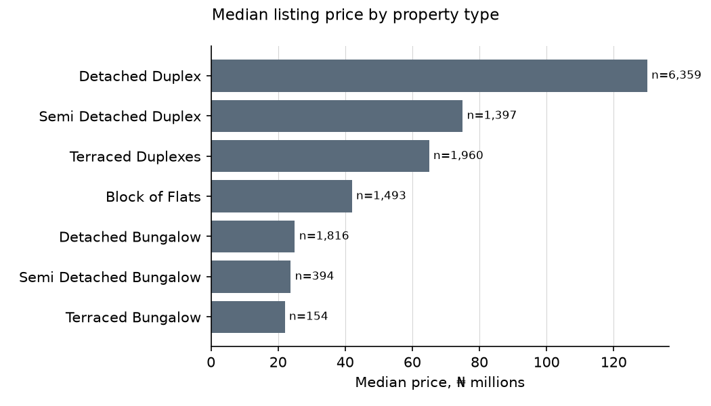
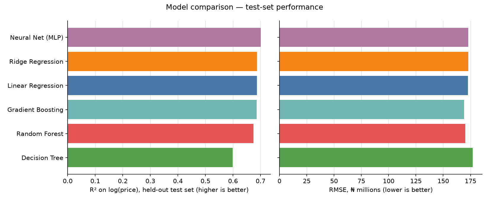

# Nigerian House Price Prediction

Predicts the asking price of Nigerian houses from their listing details, comparing
six regression algorithms, from linear regression (the baseline) to a neural
network. A Streamlit dashboard shows the comparison and runs a live predictor.

## Dataset

[Nigeria Houses and Prices Dataset](https://www.kaggle.com/datasets/abdullahiyunus/nigeria-houses-and-prices-dataset)
on Kaggle (`data/nigeria_houses_data.csv`): 24,326 listings scraped from
nigeriapropertycentre.com.

| Column | Role |
|---|---|
| `title` (property type), `town`, `state` | categorical features |
| `bedrooms`, `bathrooms`, `toilets`, `parking_space` | numeric features |
| `price` (₦) | target |

### Cleaning

`src/data.py::clean_data()` runs on every load:

| Step | Rows |
|---|---:|
| Raw CSV | 24,326 |
| Drop exact duplicate rows (10,438 repeated listings) | 13,888 |
| Keep ₦5M ≤ price ≤ ₦2B | 13,714 |

Without the duplicate removal, the same listing would appear in both the train and
test sets. The price bounds are fixed constants, roughly the 1st and 99.5th
percentiles. They remove implausible values such as a ₦1.8 trillion typo.

Towns with fewer than 10 listings (about half of the 184) share a single
"infrequent" one-hot column.

Price rises clearly with bedroom count and property type:




### Why a log target

Prices are heavily right-skewed: the median is ₦75M but the top listings reach ₦2B.
Every model is fitted on `log(price)` using `TransformedTargetRegressor`, and its
predictions are converted back to naira. This keeps the handful of most expensive
listings from dominating the fit and lets errors scale with price. For the same
reason, the headline metric is **R² on log(price)**.

## Setup

Requires Python 3.12+.

```bash
python3 -m venv .venv
source .venv/bin/activate
pip install -r requirements.txt
```

## Usage

Train and compare all models. This writes the fitted pipelines and the metrics to
`artifacts/`:

```bash
python -m src.train
```

Launch the dashboard. It trains the models on first run if `artifacts/` doesn't
exist yet:

```bash
streamlit run app.py
```

Regenerate the charts in this README after retraining:

```bash
python -m scripts.generate_report_assets
```

## Results

Each model is trained inside the same `Pipeline`: one-hot encoding for the
categorical features, standard scaling for the numeric ones, and a log-price target.
The data is split 80/20 into train and test sets. Cross-validation (5-fold) runs on
the training split only.



| Model | R² (log price) | RMSE (₦M) | MAE (₦M) | CV R² (log price), mean ± std |
|---|---:|---:|---:|---:|
| **Neural Net (MLP)** | 0.701 | 172.9 | 71.6 | 0.708 ± 0.011 |
| Ridge Regression | 0.687 | 172.8 | 73.2 | 0.694 ± 0.011 |
| Linear Regression *(baseline)* | 0.687 | 172.6 | 73.3 | 0.693 ± 0.011 |
| Gradient Boosting | 0.686 | 169.0 | 71.6 | 0.686 ± 0.010 |
| Random Forest | 0.674 | 170.3 | 72.1 | 0.681 ± 0.009 |
| Decision Tree | 0.598 | 177.0 | 75.4 | 0.609 ± 0.014 |

R² is measured on log price, the scale the models are trained on. RMSE and MAE are
in naira, after converting predictions back from the log scale.

**Best model: Neural Net (MLP)**, with R² = 0.701 on log price (0.708 in
cross-validation). It only narrowly beats the Linear Regression baseline (0.687), and
Gradient Boosting has the lowest RMSE. The more flexible models therefore add little
over a linear fit on these features. Much of the remaining error likely comes from
what the listings don't record: floor area, age, condition and exact location.

## Why we changed datasets

The project originally used `clean_nig_housing_dset.csv`, which turned out to look
synthetic:

- property type was independent of bedroom count;
- rent and sale prices had identical distributions;
- every model scored a negative R², doing worse than predicting the mean.

The Kaggle dataset consists of real scraped listings, and its prices follow the
features you'd expect.

## Project structure

- `src/data.py`: schema, cleaning, and the shared preprocessing pipeline
- `src/models/`: one module per algorithm, plus the registry and chart colours
- `src/train.py`: trains, scores, and saves every model
- `src/metrics.py`: RMSE, MAE, R²
- `app.py`: Streamlit dashboard (model comparison + interactive predictor)
- `scripts/generate_report_assets.py`: regenerates the charts in this README
